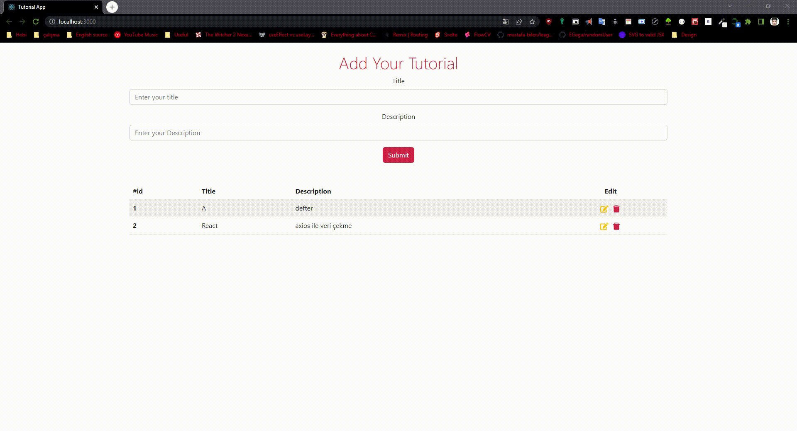

# Tutorial App

## Expected Outcome



# Deployed Frontend

## https://mfurkan40.github.io/React-Tutorial-App/

# API Base URLs

## https://639cba2542e3ad69273a89b3.mockapi.io/api/tutorialss

- The API was created and used for free via mockApi.io websites
- Then, a tutorial app list similar to To Do list was created by performing CRUD operations with axios

### API ENDPOINTS

- GET `api/tutorialss` get all Tutorials
- GET `api/tutorialss/:id` get Tutorial by id
- POST `api/tutorialss` add new Tutorial
- PUT `api/tutorialss/:id` update Tutorial by id
- DELETE `api/tutorialss/:id` remove Tutorial by id
- DELETE `api/tutorialss` remove all Tutorials
- GET `api/tutorialss/published` find all published Tutorials
- GET `api/tutorialss?title=[keyword]` find all Tutorials which title contains 'keyword'

## Project Skeleton

```
Tutorial App (folder)
|
|----readme.md
SOLUTION
├── public
│     └── index.html
├── src
│    ├── components
│    │       ├── AddTutorial.js
│    │       │     └── Button.js
│    │       │
│    │       ├── EditTutorial.js
│    │       │
│    │       │
│    │       └── TutorialList.js
│    │             └── Task.js
│    ├── pages
│    │       └── Home.js
│    │
│    ├── App.js
│    ├── App.css
│    ├── index.js
│    └── index.css
├── package.json
└── yarn.lock
```

### At the end of the project, following topics are to be covered;

- HTML

- CSS

- JS

- ReactJS

## Steps to Solution

- Step 1: Create React App using `npx create-react-app task-tracker`

- Step 2 : Install `"react-icons"` package to your `package.json` for icons.

- Step 3: Build Task Tracker App.

- Step 4: You can use CSS frameworks like Bootstrap, Semantic UI.

- Step 5: Push your application into your own public repo on Github

- Step 6: Add project gif to your project and README.md file.

# Getting Started with Create React App

This project was bootstrapped with [Create React App](https://github.com/facebook/create-react-app).

## Available Scripts

In the project directory, you can run:

### `npm start`

Runs the app in the development mode.\
Open [http://localhost:3000](http://localhost:3000) to view it in your browser.

The page will reload when you make changes.\
You may also see any lint errors in the console.

### `npm test`

Launches the test runner in the interactive watch mode.\
See the section about [running tests](https://facebook.github.io/create-react-app/docs/running-tests) for more information.

### `npm run build`

Builds the app for production to the `build` folder.\
It correctly bundles React in production mode and optimizes the build for the best performance.

The build is minified and the filenames include the hashes.\
Your app is ready to be deployed!

See the section about [deployment](https://facebook.github.io/create-react-app/docs/deployment) for more information.

### `npm run eject`

**Note: this is a one-way operation. Once you `eject`, you can't go back!**

If you aren't satisfied with the build tool and configuration choices, you can `eject` at any time. This command will remove the single build dependency from your project.

Instead, it will copy all the configuration files and the transitive dependencies (webpack, Babel, ESLint, etc) right into your project so you have full control over them. All of the commands except `eject` will still work, but they will point to the copied scripts so you can tweak them. At this point you're on your own.

You don't have to ever use `eject`. The curated feature set is suitable for small and middle deployments, and you shouldn't feel obligated to use this feature. However we understand that this tool wouldn't be useful if you couldn't customize it when you are ready for it.

## Learn More

You can learn more in the [Create React App documentation](https://facebook.github.io/create-react-app/docs/getting-started).

To learn React, check out the [React documentation](https://reactjs.org/).

### Code Splitting

This section has moved here: [https://facebook.github.io/create-react-app/docs/code-splitting](https://facebook.github.io/create-react-app/docs/code-splitting)

### Analyzing the Bundle Size

This section has moved here: [https://facebook.github.io/create-react-app/docs/analyzing-the-bundle-size](https://facebook.github.io/create-react-app/docs/analyzing-the-bundle-size)

### Making a Progressive Web App

This section has moved here: [https://facebook.github.io/create-react-app/docs/making-a-progressive-web-app](https://facebook.github.io/create-react-app/docs/making-a-progressive-web-app)

### Advanced Configuration

This section has moved here: [https://facebook.github.io/create-react-app/docs/advanced-configuration](https://facebook.github.io/create-react-app/docs/advanced-configuration)

### Deployment

This section has moved here: [https://facebook.github.io/create-react-app/docs/deployment](https://facebook.github.io/create-react-app/docs/deployment)

### `npm run build` fails to minify

This section has moved here: [https://facebook.github.io/create-react-app/docs/troubleshooting#npm-run-build-fails-to-minify](https://facebook.github.io/create-react-app/docs/troubleshooting#npm-run-build-fails-to-minify)
